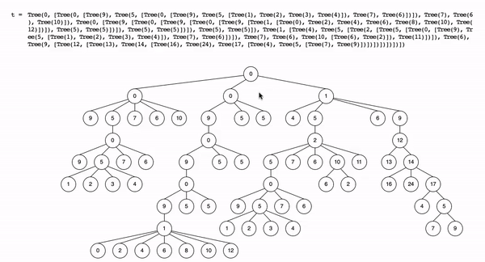

# Tree Visualizer

Simple visualizer designed for CS61A's implementation of the Tree datatype using Python3 and an online graphics library.

## Functionality

The program draws an instance of Tree onto a graphics window, using circles to represent nodes and connecting parent nodes to their children with lines. The __repr__ of the Tree object will also be drawn onto the window. The circles can then be highlighted along with their corresponding __repr__'s. 

## Setup 
Download all .py files in the same directory. To draw a Tree, open the user.py file and assign some instance of Tree to variable 'tree' on line 38 (make_tree can create a random Tree object to draw).  

Then, run user.py from the console, which should open the graphics window. Clicking a node on this window will highlight that subtree as well as its textual representation; click again anywhere on the window to un-highlight.  
